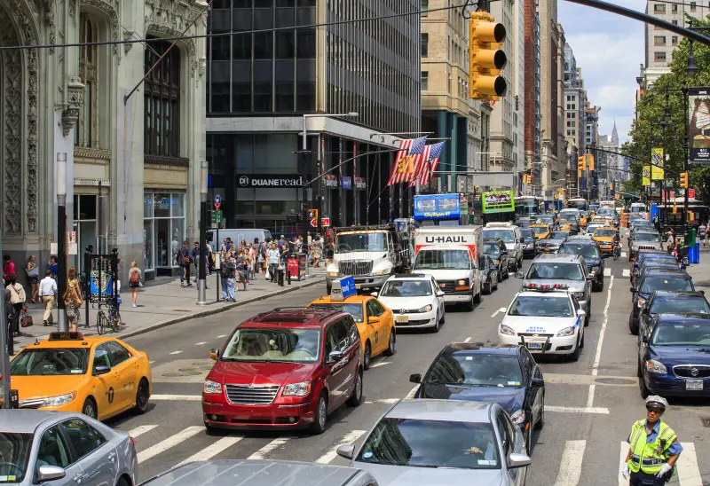
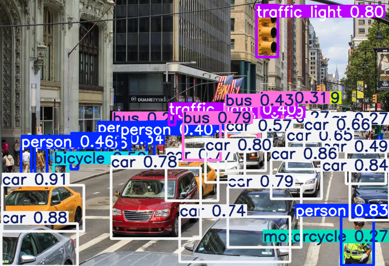
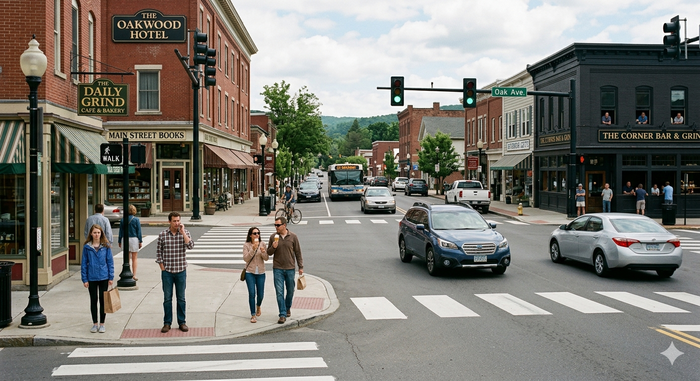
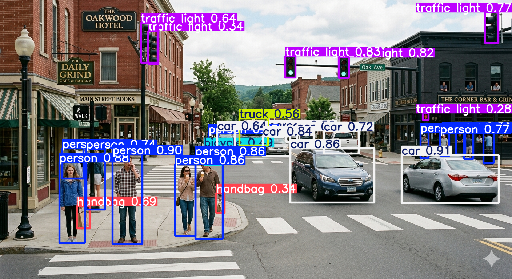

# ADAS Perception Pipeline – Object Detection (System Perspective)

## Overview

This project demonstrates a basic AI-based object detection pipeline applied to road traffic scenarios using a pretrained YOLOv5 model.

The focus is not on model training, but on understanding how an AI perception component behaves within an ADAS (Advanced Driver Assistance Systems) architecture from a system engineering perspective.

---

## System Context (ADAS Pipeline)

Camera → Perception (Object Detection) → Tracking → Decision → Actuation

This prototype represents only the **perception layer**, providing object-level information to downstream ADAS components.

---

## Input & Output

**Input:**

* Camera image frames representing traffic environments (urban and low-density scenarios)

**Output:**

* Detected objects including:

  * Object class (car, pedestrian, traffic light, etc.)
  * Bounding box (object location)
  * Confidence score

---

## Scenario-Based Analysis

### Scenario 1 — Dense Urban Environment

* High object density leads to overlapping detections
* Reduced confidence for distant or occluded objects
* Increased uncertainty in perception output

**Insight:**
Perception performance degrades in cluttered environments with occlusion and high scene complexity.

---

### Scenario 2 — Low-Density Environment

* Clear and stable detections with higher confidence
* Minimal overlap and better object separation
* More reliable perception performance

**Insight:**
Perception performs significantly better in structured and less complex environments.

---
## Scenario Comparison (Visual Analysis)

### Dense Urban Scenario




**Observation:**

* High object density leads to overlapping detections
* Multiple detections with lower confidence
* Increased ambiguity in perception output

---

### Low-Density Scenario




**Observation:**

* Clear object separation
* Higher confidence detections
* More stable perception output

---

## Key Engineering Insight

* AI perception performance is highly sensitive to environmental complexity
* Dense urban environments introduce occlusion, clutter, and ambiguity
* Detection output alone is insufficient → requires tracking, filtering, and context awareness
--
## System Constraints

* **Latency:** Real-time processing required (~50–100 ms per frame)
* **Detection Reliability:** High accuracy needed for safety-critical objects (e.g., pedestrians)
* **Environmental Robustness:** Performance varies based on scene complexity, lighting, and occlusion

---

## Failure Scenarios

### Urban Scenario

* Missed or low-confidence detection of pedestrians
* Overlapping detections causing ambiguity

**Impact:**
Incorrect or delayed decision (e.g., failure to trigger braking)

---

### Low-Density Scenario

* Detection of irrelevant objects (e.g., background pedestrians not in driving path)
* Lack of contextual awareness

**Impact:**
Unnecessary processing or false alerts in downstream systems

---

## Safety Perspective

Perception failures can propagate through the ADAS pipeline and lead to unsafe system behavior.

Example:

* Missed pedestrian detection
  → No object passed to decision layer
  → No braking triggered
  → Potential collision

---

## Key Takeaways

* AI-based perception provides **object-level data, not decisions**
* Detection alone is insufficient for ADAS functionality
* System safety depends on:

  * tracking and prediction
  * sensor fusion (radar, LiDAR)
  * fallback and degraded modes

---
## How to Run (Quick Demo)

1. Clone repository:

   ```bash
   git clone https://github.com/rakarthi1990-hub/adas-perception-pipeline.git
   cd adas-perception-pipeline
   ```

2. Install dependencies:

   ```bash
   pip install torch torchvision
   pip install ultralytics
   ```

3. Run object detection:

   ```bash
   python yolov5/detect.py --source path_to_image --weights yolov5s.pt
   ```

---

## Note

This project focuses on **system-level analysis of perception behavior**, not model training or optimization.
--

## Project Purpose

This project demonstrates understanding of AI-based perception as a subsystem within ADAS, including its limitations, constraints, and impact on system-level behavior.
